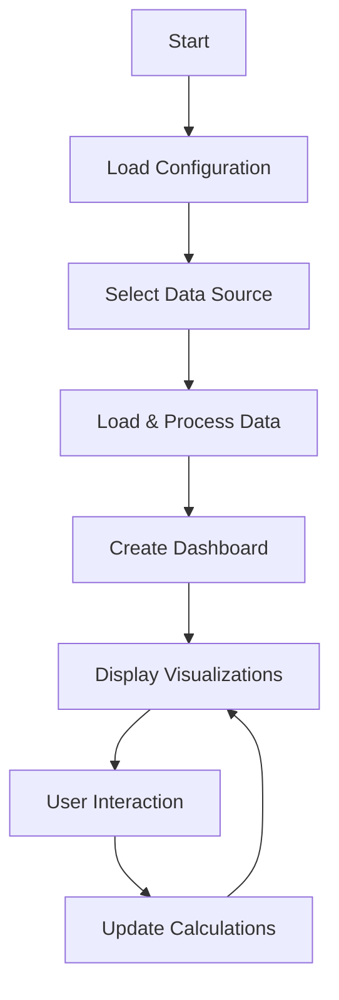

# Asset Management Dashboard

Een interactieve dashboard voor het beheren en visualiseren van asset management data.

## Features

- Vervangingsinvesteringen visualisatie
- Exploitatiebudget analyse
- Dynamische factor aanpassingen
- Interactieve grafieken en tabellen

## Project Structure

```
gemeente-mvp/
├── src/                    # Source code
│   ├── vervangingsinvestering.py  # Main Streamlit app
│   └── data_loader.py     # Data loading utilities
├── data/                  # Data files
│   ├── csv/              # CSV data files
│   └── excel/            # Excel data files
├── docs/                  # Documentation
│   └── CONTRIBUTING.md   # Contribution guidelines
├── tests/                # Test files
└── requirements.txt      # Project dependencies
```

## Application Flow



## Installation

```bash
pip install -r requirements.txt
```

## Usage

1. Place your data files in the appropriate directory:
   - Excel files in `data/excel/`
   - CSV files in `data/csv/`

2. Run the application:
```bash
cd src
streamlit run vervangingsinvestering.py
```

3. Select your data source from the sidebar
4. Interact with the visualizations and adjust factors as needed

## Data Format

Your data files (both CSV and Excel) should have the following structure:
- First column: Object names
- Third column: Waarde (numerical values)

Example:
```csv
Object,Description,Waarde
"Wegdek A","Beschrijving",100000
"Wegdek B","Beschrijving",150000
```

## Contributing

See [CONTRIBUTING.md](docs/CONTRIBUTING.md) for development guidelines.

## Requirements

- Python 3.8+
- Streamlit
- Pandas
- Plotly
- NumPy
